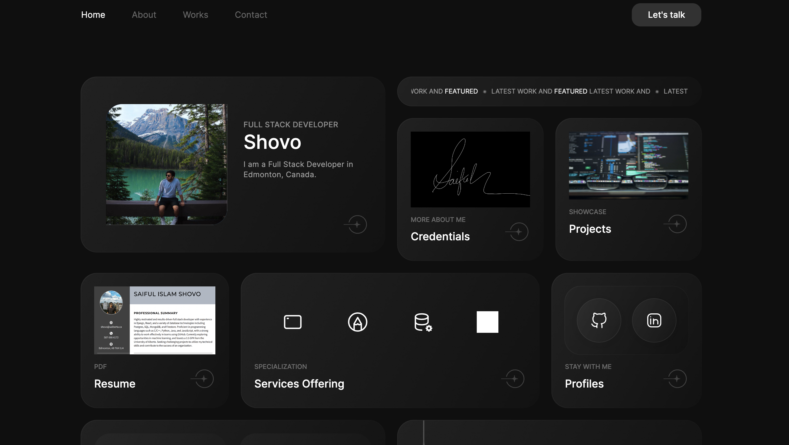
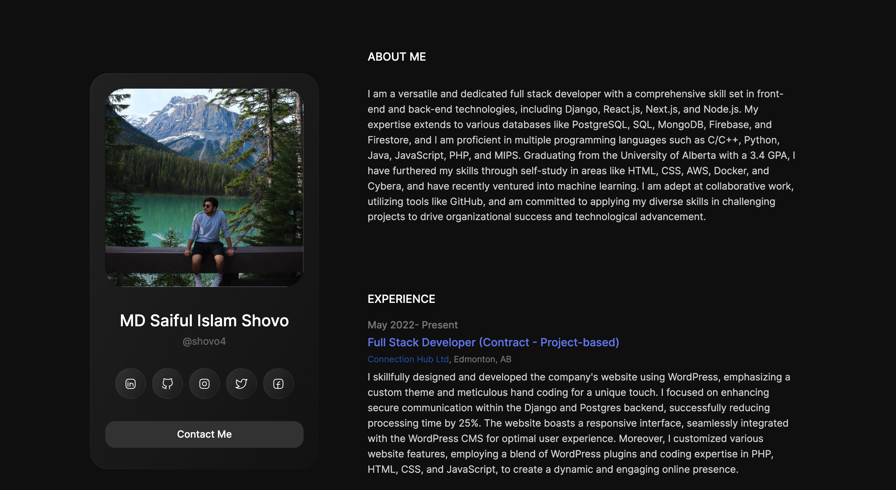

# Portfolio - [shovo.ca](https://shovo.ca/)

## Introduction
Welcome to my digital portfolio at Shovo.ca! I'm Shovo, a passionate and skilled Full Stack Developer with a knack for creating dynamic and user-friendly digital solutions. This website serves as a window into my professional world, where you can explore my projects, get to know my work style, and understand the services I offer.

As a graduate from the University of Alberta with a diverse skill set in technologies like Django, React.js, and various databases, my journey in tech has been one of constant learning and application. Here, you'll find a detailed showcase of my work, insights into my development approach, and my ongoing endeavors in expanding my expertise in areas like machine learning.

Whether you're a potential employer, a fellow developer, or just curious about my work, I hope you find this portfolio informative and inspiring. Don't forget to check out my resume for a comprehensive view of my skills and experiences. If you're interested in collaborating or have any questions, feel free to reach out through my contact information or connect with me on social media. Enjoy your visit!

## Technologies Used
- HTML, CSS, JavaScript
- WordPress
- PHP

## Domain Information
- Domain: shovo.ca
- Registrar: Go Daddy Domains Canada, Inc
- Registered On: 2023-04-30
- Expires On: 2024-04-30

## Features and Highlights
- Home page: https://shovo.ca/index.html
- About page: https://shovo.ca/index.html
- Credentials page: https://shovo.ca/credentials.html
- Work page: https://shovo.ca/works.html
- Contact Page: https://shovo.ca/contact.html

## Website Screenshots

## Future Enhancements
[Upcoming features or enhancements]

## Contact
- [Linkedin](https://www.linkedin.com/in/saifulshovo/)
- [Instagram](https://www.instagram.com/shovo_4/)

## Acknowledgments
- https://wordpress.com/
